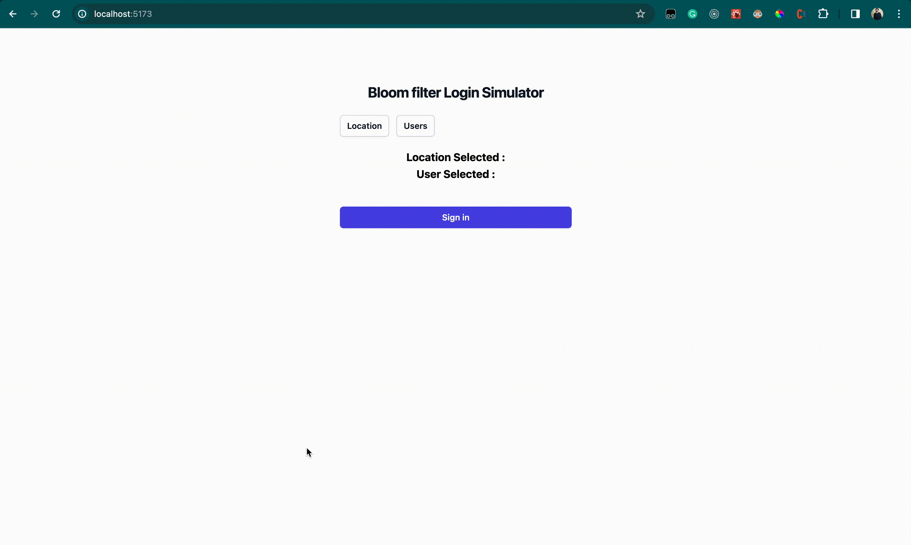

# IP Filter Tracker with Bloom Filter


A simple IP filter tracker implemented using a Bloom filter. This project allows you to efficiently check whether an IP address is present in a given set of IP addresses using a probabilistic data structure known as a Bloom filter.

## Instructions 

**Backend setup**

```sh
cd backend
go mod tidy
go run .

```

You should see the backend running on ``localhost:8080``

**Frontend Setup**

```sh
cd frontend
yarn && yarn dev
```

The frontend must be accessible in ``localhost:5173``

## Demo


